<p align="center"></p>

# 실버로드 (SilverRoad)

> 경험이 만든 신뢰, 실버로드 배송

졸업작품 · 프론트엔드 · 2025.05 ~ 2025.06

시니어(실버) 근로자가 배달원으로 일하는 배송 서비스의 웹 프론트엔드입니다. 고객은 배송을 접수하고 진행 상황을 확인합니다. 기업(관리자)은 접수 내역과 직원을 관리하고, 배달원 위치를 지도에서 실시간으로 확인합니다.

> **안내**
> 이 저장소에는 프론트엔드(React)만 있습니다. 백엔드는 별도 API 서버(REST + WebSocket)로 운영했고, 이 저장소의 커밋은 모두 본인 작업입니다.

---

## 1. 프로젝트 소개

### 사용자 흐름

```text
                  ┌─ 사용자 로그인(구글) ─ 회원 정보 등록(첫 로그인) ─ 랜딩 ─ 배송 접수 ─ 내 배송 리스트 ─ 배송 상세
로그인 선택 화면 ─┤
                  └─ 기업 로그인(ID/PW) ─ 배송 접수 리스트 ─ 배송 상세
                                          ├─ 대시보드 (배달원 실시간 위치)
                                          └─ 직원 리스트 ─ 직원 등록
```

### 시스템 구성

```text
 React SPA (Netlify) ──REST · axios + JWT──▶ 백엔드 API 서버
        │            ◀──WebSocket · 배달원 위치──┘
        ├── Google Maps JavaScript API   (대시보드 지도)
        ├── 다음 우편번호 서비스          (주소 검색)
        └── Google OAuth                 (백엔드를 거치는 리다이렉트 로그인)
```

### 기술 스택

| 영역 | 기술 |
| --- | --- |
| Frontend | React 19 (Create React App), React Router 7, styled-components, CSS |
| 통신 | axios (JWT 인터셉터), WebSocket |
| 외부 API | Google Maps JavaScript API, Google OAuth, 다음 우편번호 서비스 (react-daum-postcode) |
| 배포 | Netlify |

---

## 2. 화면

> 화면 이미지는 로컬에서 백엔드 응답을 예시 데이터로 바꿔 캡처했습니다. 이름·연락처·주소는 모두 가상입니다. 로컬 환경이라 지도에는 Google 개발용 워터마크가 표시됩니다.

### 로그인

<table>
<tr>
<td width="33%" align="center">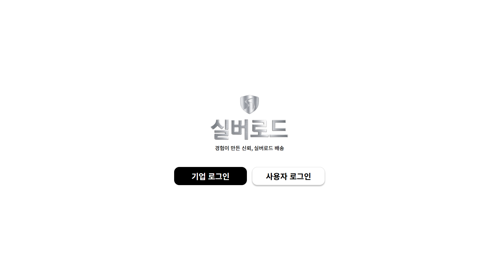</td>
<td width="33%" align="center">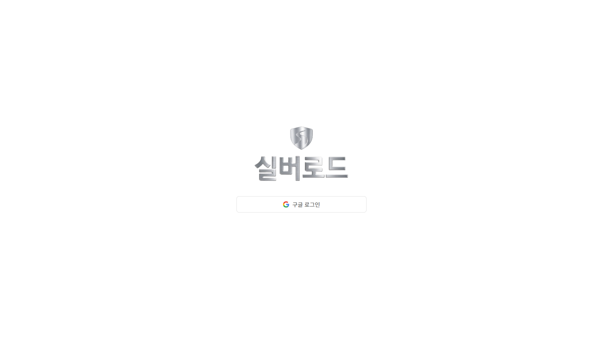</td>
<td width="33%" align="center">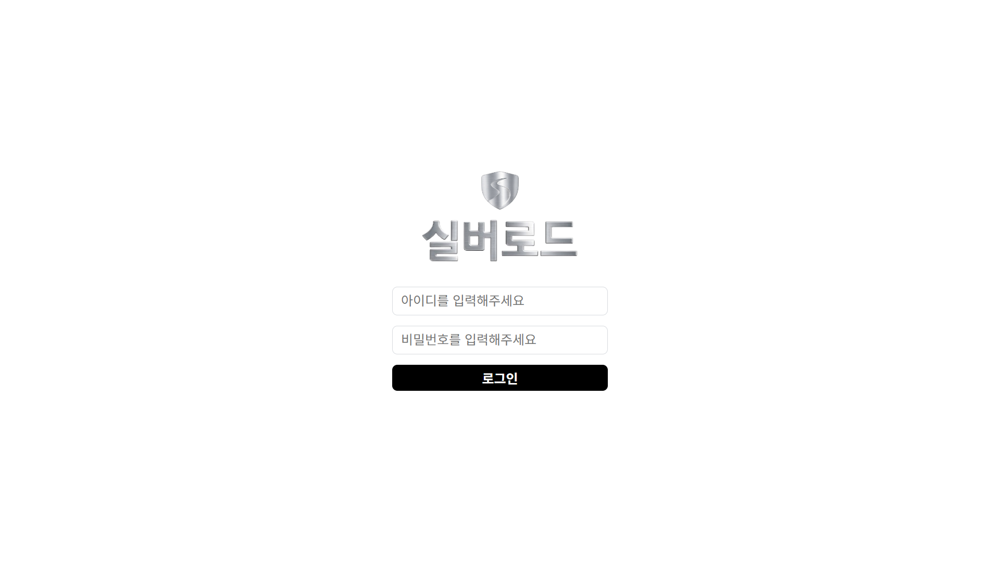</td>
</tr>
<tr>
<td align="center"><b>로그인 선택</b><br>기업 / 사용자 진입 분리</td>
<td align="center"><b>사용자 로그인</b><br>구글 계정 로그인</td>
<td align="center"><b>기업 로그인</b><br>관리자가 발급한 ID/PW</td>
</tr>
</table>

### 고객

<table>
<tr>
<td width="50%" align="center">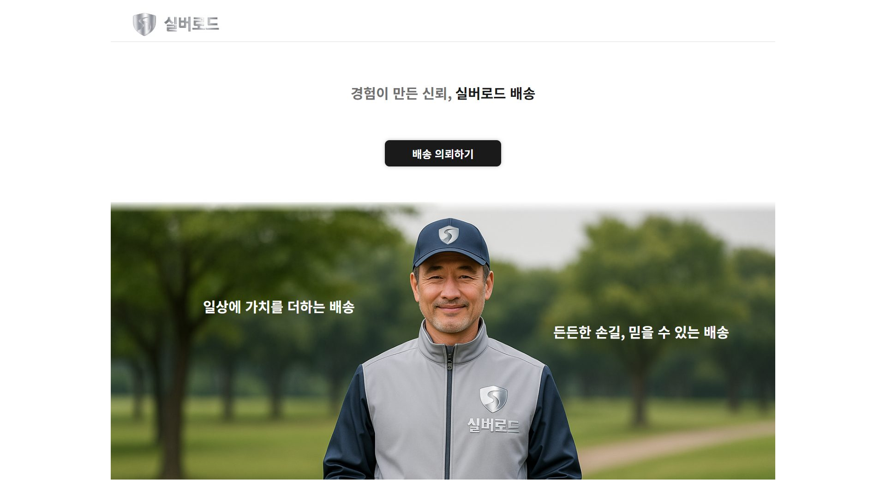</td>
<td width="50%" align="center">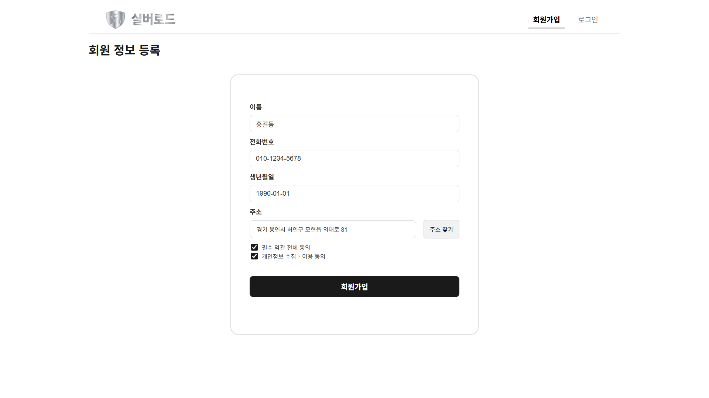</td>
</tr>
<tr>
<td align="center"><b>랜딩</b><br>서비스 소개와 배송 의뢰 진입</td>
<td align="center"><b>회원 정보 등록</b><br>첫 로그인 시 이름·연락처·주소 입력</td>
</tr>
<tr>
<td align="center">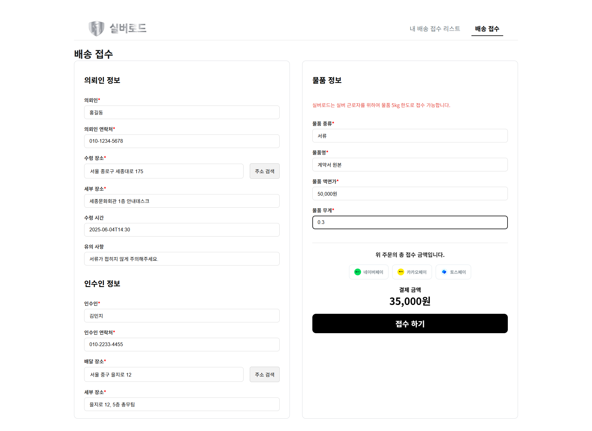</td>
<td align="center">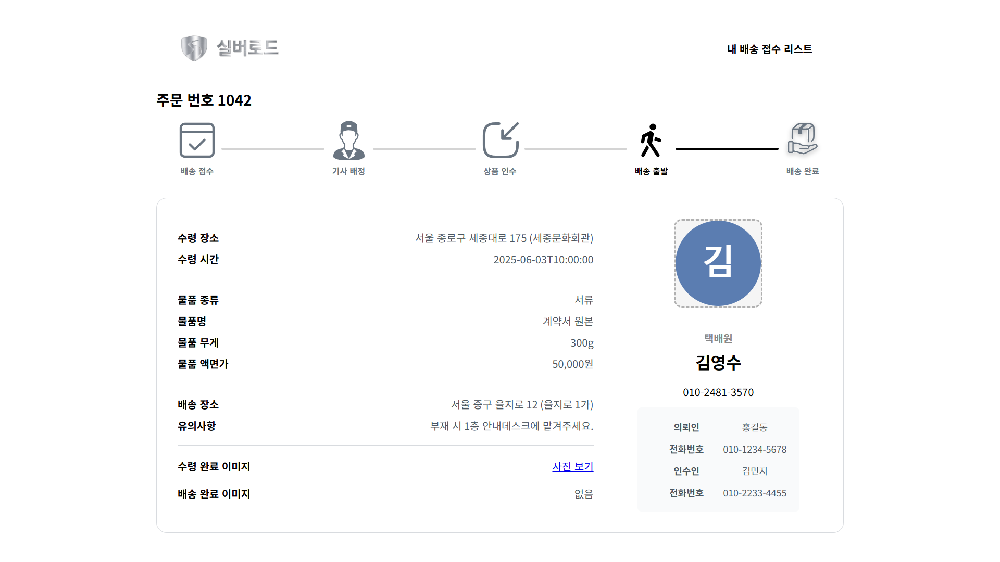</td>
</tr>
<tr>
<td align="center"><b>배송 접수</b><br>의뢰인·인수인·물품 정보, 주소 검색</td>
<td align="center"><b>배송 상세</b><br>5단계 진행 상태, 담당 택배원, 수령·배송 완료 사진</td>
</tr>
<tr>
<td colspan="2" align="center">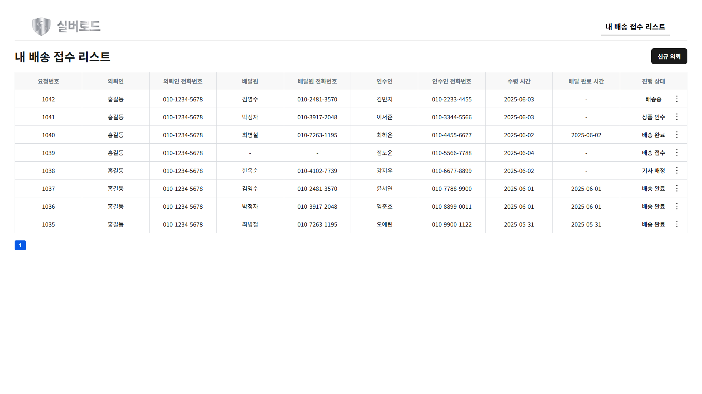</td>
</tr>
<tr>
<td colspan="2" align="center"><b>내 배송 접수 리스트</b><br>요청별 진행 상태 확인, 접수 단계에서 취소</td>
</tr>
</table>

### 기업(관리자)

<table>
<tr>
<td colspan="3" align="center">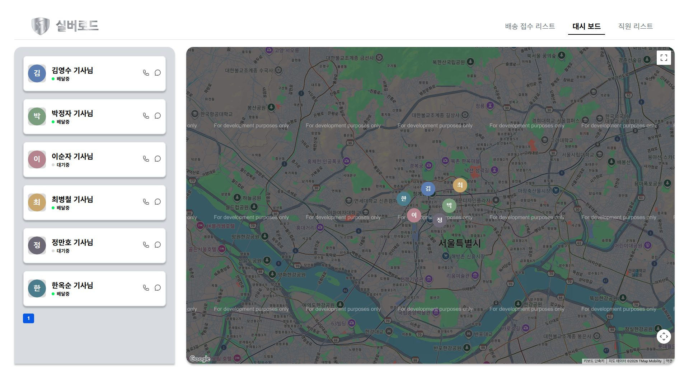</td>
</tr>
<tr>
<td colspan="3" align="center"><b>실시간 대시보드</b><br>배달원 상태 목록 + WebSocket으로 받은 위치를 프로필 사진 마커로 표시</td>
</tr>
<tr>
<td width="33%" align="center">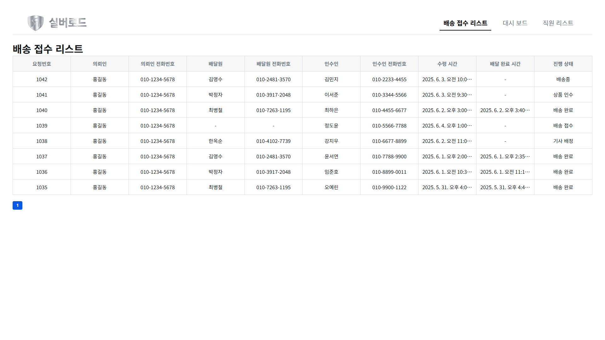</td>
<td width="33%" align="center">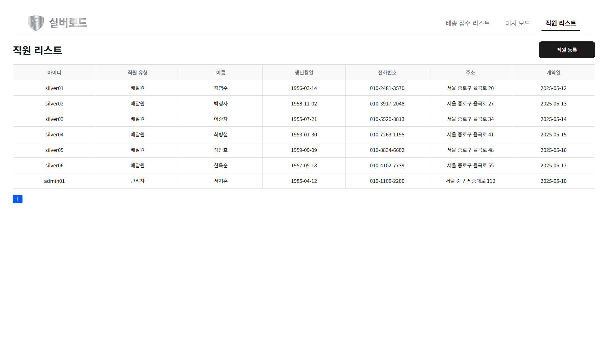</td>
<td width="33%" align="center">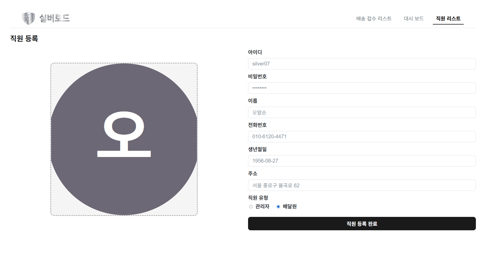</td>
</tr>
<tr>
<td align="center"><b>배송 접수 리스트</b><br>전체 접수 내역과 진행 상태</td>
<td align="center"><b>직원 리스트</b><br>관리자·배달원 목록</td>
<td align="center"><b>직원 등록</b><br>프로필 사진과 직원 유형 등록</td>
</tr>
</table>

---

## 3. 주요 기능

### 고객

- **구글 로그인**: 백엔드의 OAuth 주소로 이동하고, 콜백(`/cus/success`)에서 쿼리로 받은 access/refresh 토큰을 저장합니다. 계정에 주소가 없으면 첫 로그인으로 보고 회원 정보 등록으로, 있으면 랜딩으로 보냅니다.
- **회원 정보 등록**: 이름·전화번호·생년월일·주소(다음 우편번호 검색)를 받고, 필수 약관에 동의하기 전에는 가입 버튼을 비활성화합니다.
- **배송 접수**
  - 의뢰인 이름·연락처는 계정 정보로 자동 입력합니다.
  - 수령지·배송지는 주소 검색과 세부 장소로 나눠 받습니다.
  - 물품 정보를 받으면서 실버 근로자를 위한 5kg 한도를 안내합니다.
  - 필수 항목을 모두 채워야 접수 버튼이 활성화됩니다.
  - 입력값은 API 형식으로 변환해 보냅니다(예: 액면가 `"50,000원"` → `50000`).
- **내 배송 접수 리스트**: 요청별 배달원·인수인·시간·진행 상태를 보여 주고, `배송 접수` 상태에서만 취소할 수 있습니다.
- **배송 상세**: 배송 접수 → 기사 배정 → 상품 인수 → 배송 출발 → 배송 완료 5단계 중 현재 단계를 표시합니다. 담당 택배원의 프로필·연락처와 수령/배송 완료 사진 링크도 함께 보여 줍니다.

### 기업(관리자)

- **ID/PW 로그인**: 관리자가 등록한 계정으로 로그인합니다.
- **배송 접수 리스트·상세**: 전체 접수 내역을 보고, 행을 누르면 상세 화면으로 이동합니다.
- **실시간 대시보드**
  - 활동 중인 배달원 목록(배달중/대기중)과 Google Maps 지도를 함께 보여 줍니다.
  - 배달원 카드를 누르면 지도가 그 배달원 위치로 이동합니다.
  - 카드에서 바로 전화·문자(`tel:` / `sms:`)를 보낼 수 있습니다.
- **직원 리스트·등록**: 서버 페이지네이션으로 목록을 불러옵니다. 등록할 때는 프로필 사진을 미리 보여 주고, 관리자/배달원 유형과 함께 `multipart/form-data`로 전송합니다.

---

## 4. 구현 포인트

**1. 토큰 인증과 자동 재발급**
axios 인스턴스의 요청 인터셉터가 모든 요청에 `Authorization: Bearer` 토큰을 붙입니다. 응답이 401이면 refresh 토큰으로 access 토큰을 재발급받아 실패한 요청을 한 번 다시 보냅니다. 재발급도 실패하면 토큰을 지우고 로그인 화면으로 보냅니다. `_retry` 플래그로 같은 요청을 무한히 재시도하지 않게 막았습니다.

**2. 사용자 유형별 접근 제어**
`ProtectedRoute`로 로그인이 필요한 경로를 감쌌습니다. 토큰이 없으면 경로가 `/cus`로 시작하는지에 따라 사용자 로그인 또는 기업 로그인 화면으로 돌려보냅니다.

**3. 배달원 실시간 위치**
- **마커 재사용**: 배달원 ID별 마커를 `Map`에 보관합니다. 새 위치가 오면 마커를 다시 만들지 않고 `setPosition`으로 위치만 옮깁니다.
- **최신 직원 목록 참조**: 소켓 핸들러는 effect 안에서 한 번만 만들어집니다. 그래서 직원 목록을 ref로도 들고 있고, 나중에 도착한 목록의 프로필 사진도 마커에 쓸 수 있게 했습니다.
- **연결 관리**: 연결이 끊기면 3초 뒤 자동으로 다시 연결합니다. 화면을 벗어나면 소켓과 재연결 타이머를 정리합니다.
- **지도 스크립트**: Google Maps 스크립트는 대시보드에 들어갈 때 한 번만 동적으로 불러옵니다.

**4. 목업으로 화면 먼저, 이후 API 연동**
백엔드가 준비되기 전에는 `public/data/*.json` 목업 데이터로 화면을 먼저 완성했습니다(05/26 ~ 05/28). API가 나온 뒤에는 호출을 `services/api.js`로 모아 실제 API로 교체했습니다(06/02).

**5. Netlify SPA 라우팅**
`/cus/deliverylist` 같은 하위 경로로 바로 접속하거나 새로고침해도 404가 나지 않게 했습니다. `_redirects`로 모든 경로를 `index.html`로 보냅니다.

---

## 5. 개발 과정

커밋 기록을 기준으로 정리했습니다.

| 날짜 | 내용 |
| --- | --- |
| 2025.05.25 | Create React App으로 프로젝트 구성, 로그인 선택 화면 |
| 05.26 | 기업 화면(로그인, 배송 접수 리스트·상세, 직원 리스트·등록)을 목업 JSON으로 구성 · 고객 화면 초안(랜딩, 로그인, 회원가입, 배송 접수, 내 배송 리스트) · 배송 단계 아이콘 |
| 05.27 | 대시보드 레이아웃: Google Maps 지도 + 배달원 카드 |
| 05.28 | 고객 배송 상세 화면 추가, 대시보드 배달원 목록을 목업 데이터로 연결, 화면 전반 정리 |
| 06.02 | 백엔드 연동: API 모듈, axios 인스턴스(토큰 첨부·재발급), `ProtectedRoute`, 구글 로그인 콜백 |
| 06.03 | 대시보드 WebSocket 실시간 위치·자동 재연결 · Netlify 배포(`_redirects`) · 파비콘·타이틀·manifest · 수령/배송 완료 사진 보기 |
| 06.04 | 배송 접수에 수령지·배송지 세부 주소 입력 추가 |

---

## 6. 프로젝트 구조

```text
my-app/
├── public/
│   ├── _redirects              # Netlify SPA 라우팅
│   ├── data/                   # 백엔드 연동 전 화면 개발용 목업 JSON
│   ├── icons/                  # 배송 단계 아이콘
│   └── images/                 # 로고, 랜딩 이미지, 결제 수단 아이콘
└── src/
    ├── App.js                  # 라우팅 (공개 / 고객 / 기업)
    ├── components/
    │   └── ProtectedRoute.jsx  # 로그인 여부 확인 후 유형별 로그인 화면으로 이동
    ├── login/                  # 로그인 선택 화면
    ├── cus/                    # 고객: 로그인·회원 정보 등록·랜딩·배송 접수·리스트·상세
    ├── cop/                    # 기업: 로그인·배송 리스트·상세·대시보드·직원 리스트·등록
    ├── services/               # axios 인스턴스, API 호출 함수
    └── utils/
        └── loadGoogleMaps.js   # Google Maps 스크립트 동적 로드
```

---

## 7. 실행 방법

```bash
cd my-app
npm install
npm start        # http://localhost:3000
npm run build    # 배포용 빌드
```

`my-app/.env`에 아래 값이 필요합니다.

| 변수 | 용도 |
| --- | --- |
| `REACT_APP_GOOGLE_MAPS_API_KEY` | 대시보드 지도 |
| `REACT_APP_GOOGLE_CLIENT_ID` | `GoogleOAuthProvider` 클라이언트 ID |
| `REACT_APP_BACKEND_URL` | 구글 로그인 리다이렉트 대상 서버 |

API 서버 주소는 `src/services/axiosInstance.js`의 `BASE_URL`에 있습니다. 로그인 이후 화면은 백엔드 서버가 함께 실행 중이어야 데이터가 표시됩니다.

---

## 한계

- 결제 수단 버튼(네이버페이·카카오페이·토스페이)은 화면만 구현했고 실제 결제 연동은 없습니다. 결제 금액도 35,000원으로 고정돼 있습니다.
- 배달원 위치는 대시보드에 들어온 뒤 WebSocket으로 받은 것부터 표시합니다. 위치를 받기 전에는 카드를 눌러도 지도가 이동하지 않습니다.
